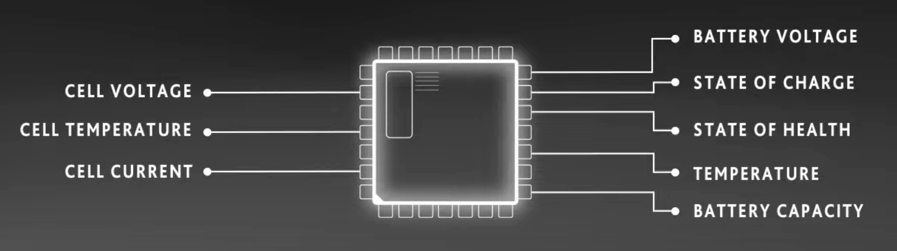

# OpenBMS
## Why did I create this project?
Saving the earth by adopting clean renewable energy is a big ongoing trend. We can adopte more Solar energy and Wind energy to replace fossil fuel energy like coal, nature gas, oil, etc. Since the sun is not shine in the night, the wind can not blow sometimes, we need enough energy storage systems to store produced energy, and release energy from these storage when energy is demanded. Pumped hydro station is a good energy storage system when there is geographic condition and if we don't consider its long bulding duration. Battery energy storage system is the most feasible choice in terms of scalability, installation duration, and flexibility.

But:
- How to manage these large scale battery energy storage systems?
- How to schedule the charge and discharge algorithm to make these battery energy storage system have a longer lifespan and higher efficient?
- How to monitor and analyze the state of health for these large scale batteries and provide intelligent maintenance suggestions in advance by BigData and ML technology?
- A massive of Electric Vehicles batteries will be retired in next few years, these batteries has some degradation and not suitable to use in new vehicles, but they still capable and can be used for battery energy storage system for many years. How to assess the SOH of these used batteries accurately through BigData and ML technology, how to classify and manage these heterogeneous batteries to achieve best efficiency?
- What if customers don't want to buy BESS built from used batteries since they have concern about the quality and lifespan of these batteries? Pay-as-you-go energy as a service probably is a good choice.

These are the goals of this project.

## Project description
OpenBMS is a open source battery management system(BMS), aim to provide BMS for battery energy storage systems. OpenBMS monitor SOC and SOH of each battery cell in real-time, automatically balance the charge and discharge operations to achieve longer lifespan and higher efficiency for batteries. OpenBMS also collect batterier data and upload them to cloud, periodically analyze and learn these latest data and historical data to predict the remain lifetime of these batteries and provide maintenance suggestions in advance. 

## Data Management
- [ ] Implement robust data management for monitoring and collecting data from individual batteries.
- [x] Store latest battery state data locally.
- [ ] Upload data to cloud storage like S3.
- [ ] Simulator to simulate hundreds of thousand battery sensors to report data.

## Intelligent and Predictive Maintenance
- [ ] Process latest collected data and historical data with ML and BigData algorithms, to predict SOH(State-Of-Health) of each battery pack, and provide maintenance suggestions in advance.
- [ ] Analyze operational data to identify opportunities for improving overall energy efficiency, suggesting adjustments in the system configuration or operation.

## Battery Managment

### State of Charge Calculation
- [x] Develop algorithms for accurate charging/discharging SoC calculations based on battery voltage, current.
- [ ] Consider incorporating advanced techniques like Kalman filters for better estimation.

### Balancing and Equalization:
- [ ] Implement balancing algorithms to ensure that individual cells within a battery pack are charged and discharged uniformly.
- [ ] Consider equalization strategies to prolong the overall battery life.

### Energy Management
- [ ] Optimize energy usage based on grid demand and supply.
- [ ] Implement algorithms for determining when to charge and discharge batteries to maximize efficiency.

### Thermal Management:
- [ ] Monitor and control battery temperatures to optimize performance and prevent overheating.
- [ ] Implement thermal management strategies to ensure safe operation.

### State of Health Monitoring
- [ ] Monitor state of health for each pack
- [ ] Show SOH on dashboard 

## Domain Knowleges
- [x] [Characteristics](./docs/characteristic-of-lithium-ion-battery.md) of Lithium-ion batteries
- [x] [Thermal runaway issue](./docs/thermal-runaway-issue.md) of Li-ion batteries
- [x] [Why low temperature decrease batteries' performance?](./docs/decreased-perf-under-low-temperature.md)
- [x] [How to maximize Lithium-ion battery life?](./docs/how-to-maximize-lithium-ion-battery-life.md)