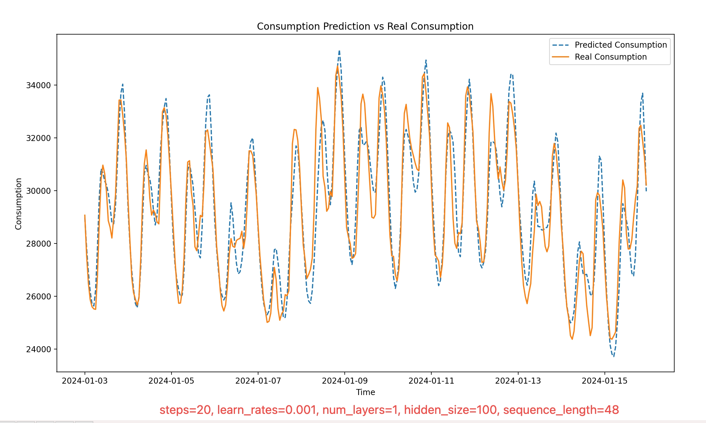

# ML

Use ML algorithms to:
- Learn the historical grid energy demand data, predict comming energy demand in hours.
- Learn and predict future solar & wind total energy generation according to input real-time weather data, predict energy shortage possibility for different areas, dynamically balance energy or change charging priority between energy stations and their storage systems in advance.
- Learn and predict battery energy storage system charging remain time.
- Learn and tune the charge and discharge scheduling & balancing algorithm to maximaze energy efficiency and battery lifespan. (minimizing charging time, maximizing energy transfer efficiency, and reducing heat generation during charging).
- Learn batteries degradation trend, predict batteries remain lifespan and provide maintenance suggestions.
- Identify State of Health (SOH) of batteries, and classify batteries into different Tiers.

## Learn and Predict the Electricity Comsuption for California



The above diagram shows the predicted electricity consumption and real consumption of california for the first half month of 2024. You can use following commands to run the electricity consumption predict program. Please make sure you have installed `pytorch`, `sklearn`, `pandas`, `numpy`, and `matplotlib`.

```
cd ml
python3 lstm/elec_comsumption.py --train_dataset=./resources/ca_electric_demand_train_2023.csv --test_dataset=./resources/ca_electric_demand_test_202401.csv --num_epochs=20 --learning_rate=0.001 --num_layers=1 --hidden_size=100 --sequence_length=48
```