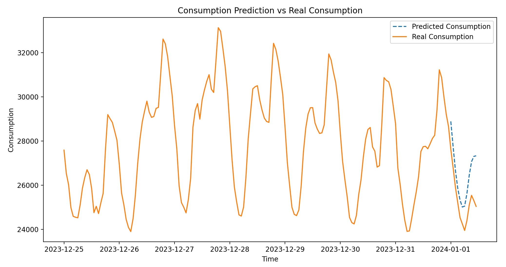
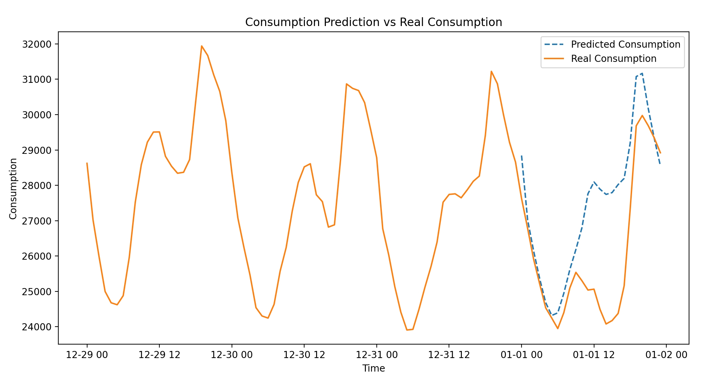
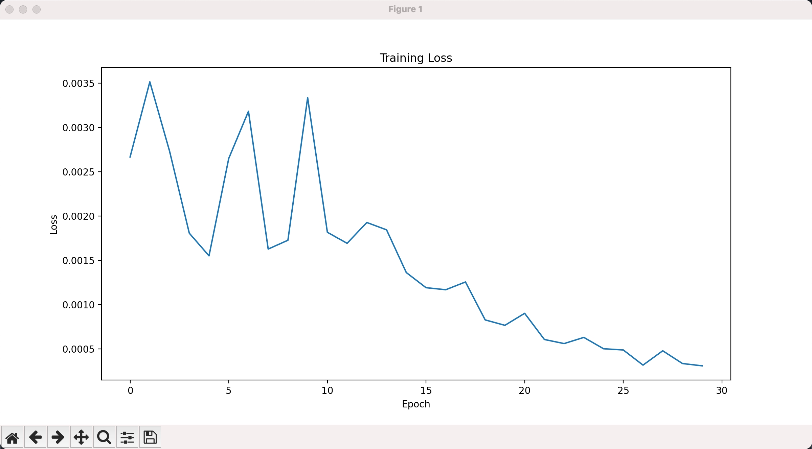

# ML

Use ML algorithms to:
- Learn the historical grid energy demand data, predict comming energy demand in hours.
- Learn and predict future solar & wind total energy generation according to input real-time weather data, predict energy shortage possibility for different areas, dynamically balance energy or change charging priority between energy stations and their storage systems in advance.
- Learn and predict battery energy storage system charging remain time.
- Learn and tune the charge and discharge scheduling & balancing algorithm to maximaze energy efficiency and battery lifespan. (minimizing charging time, maximizing energy transfer efficiency, and reducing heat generation during charging).
- Learn batteries degradation trend, predict batteries remain lifespan and provide maintenance suggestions.
- Identify State of Health (SOH) of batteries, and classify batteries into different Tiers.

## Learn and Predict the Electricity Consuption for California

Following commands are used to train and predict the electricity consumption for future. You can choose different parameters to tune the training model. We use LSTM(Long Short-Term Memory) RNN(Recurrent Nueral Network) algorithm to predict California's future electricity consumption.
```
cd ml
python3 ./lstm/elec_comsumption.py --train_dataset=./resources/ca_electric_demand_train_2023.csv \
    --test_dataset=./resources/ca_electric_demand_test_202401.csv --num_epochs=10 --learning_rate=0.001 \
    --num_layers=1 --hidden_size=100 --sequence_length=72 --target_length=24
```



Above diagram shows the predicted electricity consumption for next 12h according to last 7 days data. Please make sure you have installed `pytorch`, `sklearn`, `pandas`, `numpy`, and `matplotlib`.



Above diagras shows the predicted electricity consumption for next 24h according to last 3 days data.



This is loss regression curve when training the data.

## Learn and Predict Solar Energy Generation According to Weather, Temporature, Hour_of_Day, etc


